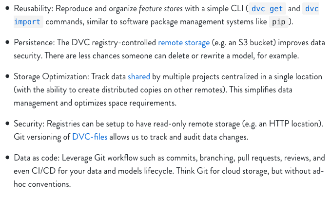

# Data Version Control (DVC) 

DVC is an open-source development tool designed with data science and machine learning practitioners in mind. Unlike a traditional software 
development workflow, machine learning often involves a multi-step cycle of data processing, compute-intensive model training, 
hyperparameter tuning, and performance evaluation. It is highly iterative and experimental in nature, not to mention data hungry and computationally demanding. 
DVC is specifically designed to fill the gap between existing software development tools and the unique needs of data scientists. More than simply 
providing data version control, DVC allows you to efficiently build, compare, reproduce, and share all components or versions of a machine learning pipeline. 

I could go on and on about how game-changing DVC has been, so here are just a few of my favorite features: 
* the git-like command line interface is easy to learn and use
* extends the benefits of git-based version control to large files like data and models
* integration with cloud storage systems (we use AWS s3) means data are both safe and accessible to everyone on the team
* efficient data and model management eliminates the need for repeated steps and makes them easy to share
* ability to conduct ML experiments such that results are completely reproducible and metrics are easily compared across different 
versions of a pipeline via git tags and branches
* all-in-one solution - in searching for ways to optimize my workflow, I looked at other options like MLFlow, Tensorboard and AWS Sagemaker, 
but none of them were as intuitive or as complete as DVC. 

In this tutorial, we cover: 

3. How to build and use a data registry 
5. How to conduct  experiments using DVC 

This tutorial assumes familiarity with DVC's basic usage, so if you're not there yet I highly recommend you check out 
their [documentation](https://dvc.org/doc/home) and this [introductory tutorial.](https://dvc.org/doc/tutorials/get-started/agenda) 
No need for me to paraphrase - they have done a phenomenal job explaining how it works. 


## How Build and Use a Data Registry 

### What is a data registry? 
A data registry is simply a DVC project dedicated to the storage and tracking of data and/or models. To keep it simple, I like to have one for data 
and one for models. The registry provides an interface to your remote storage system of choice, through which you can use and update 
large data files in a carefully tracked and versioned manner. There are several notable advantages of using such a system, best explained by the DVC makers themselves:



I will be using AWS S3 for the remote storage in this tutorial since that is what we use on my team, but the principles are the same
whether you are using local storage, GCP, SSH, etc. For a complete list of supported remote storage types, see [here](https://dvc.org/doc/command-reference/remote/add)

### Setup 
1. Set up remote storage 
    
      Suppose we have an s3 bucket called `datasets` which we use to store all our data and we have our aws access credentials stored in a profile called `dvc`.
2. Initialize your DVC project and remote
    
    In a fresh git repo, initialize DVC, add the s3 bucket as a remote and modify the profile to ensure access, then commit
    the changes. The `-d` flag indicates that this will be the DVC project's default remote. 
    
    ``` 
    dvc init
    dvc remote add -d datasets s3://datasets/dvc-data-registry
    dvc remote modify datasets profile dvc
    git add . && git commit -m "setup dvc remote" && git push
    ```


### Adding Data to the Registry 

I work with a combination of audio and text data. The workflow usually involves first
transcribing audio using an ASR model and then performing some kind of NLP on the resulting transcripts. 
I like to keep raw and processed data separate, and then organize the subdirectories according to type. So for example, my data registry might 
have the following structure: 

   ```
        sample-data-registry
        ├── raw
        │   ├── audio
        │   ├── text
        ├── text
        │   ├── transcripts
   ```

Now I want to add some raw audio data to my DVC data registry, a file called `recording.wav` that I have stored locally. 

1. Copy raw data to appropriate `raw` directory and track with DVC by calling `dvc add` 
    
   ``` 
    cp ~/Downloads/recording.wav raw/audio/
    dvc add raw/audio/recording.wav
    git add . && git commit -m "add raw recording data" && git push
    ```

2. Push data to remote storage 

    ``` 
    dvc push 
    git add . && git commit -m "push recording data to s3" && git push 
    ```

If you go look at the datasets bucket, you will find a bunch of random folders with a few files each - when you push data 
to your remote, DVC stores them in a content-addressable way. As such, you don't have to worry about duplication. The lack of 
human-readability here also means that you must rely on your neatly organized data registry for pulling/pushing data to the cloud, 
preventing any accidental deletions or changes and effectively forcing everyone on the team to use DVC :)  

### Using Data from the Registry 

Now that my raw audio file, `recordings.wav` is catalogued in my data registry and stored in s3, I want to transcribe it. 
I already have a DVC project in a repo for doing transcription with an ASR model. First I have to import the raw data into 
the transcription project repo. 

First let's get a list of what is available in the data registry (`-R` flag searches recursively to find all files in the repo): 
    ``` 
    dvc list -R https://github.com/ehutt/sample-data-registry
    ``` 
    
   output: 
   
   ```
    README.md
    raw/audio/.gitignore
    raw/audio/recording.wav
    raw/audio/recording.wav.dvc
   ```
We can see our recording there, now let's import it. We always use `dvc import` as opposed to `dvc get` since the former maintains any dependencies on the data source (i.e. the registry repo) while the latter is a simple download. 

Import data to your local workspace (must be an initialized DVC project) by specifying the registry repo and the 
path to the desired data.

   ``` 
    dvc import https://github.com/ehutt/sample-data-registry \
    raw/audio/recording.wav
   ```

### Create a Pipeline Stage

Now that I have my imported audio data, I can run my ASR model to get a transcription. I use a `dvc run` command to initiate
the transcription stage, which will keep track of which data, model, and parameters were used to generate the transcription. The `-d` flag
indicates a dependency (here, dependencies are the raw audio and the model code) and `-o` indicates an output (here, the transcript).
    
   ``` 
    dvc run -f transcribe.dvc \
    -d recording.wav \
    -d transcribe.py \
    -o transcript.txt \
    python transcribe.py recording.wav 
   ```
Running this stage generates a text file, which I now want to add to my data registry. To do so, simply copy the file 
to the registry repo and call `dvc add` again. Don't forget to `git commit` and `dvc push`. Now the data registry looks something like this: 

   ```
    data-registry
    ├── raw
    │   ├── audio
    │       ├──recording.wav
    ├── text
    │   ├── transcripts
    │       ├──recording.txt     
   ```

### Data Registry Tips and Tricks 

* To make sure you have the latest version of an imported dataset, run `dvc update` to pull any changes from remote storage.
* In the situation where you want to modify a raw dataset and store the result in your data registry, it is also possible 
to perform the steps from within the registry repo itself. In mine, I have a folder to store code so that when I do any data processing 
(e.g. take some raw text and remove html artifacts), I can maintain the dependencies using `dvc run`, without having to 
perform the above steps of copying outputs from another project into the registry and using `dvc add`, since this stops the 
DVC-tracked trail of dependencies. 
* I like to store all my DVC stage files in a dedicated folder called `dvc_files` to avoid cluttering the project repo. 

## How to Conduct Machine Learning Experiments Using DVC 

Let's run a toy experiment to compare the performance of two question-answering models. Suppose we have a labeled dataset
a la [SQuad2.0](https://rajpurkar.github.io/SQuAD-explorer/), with some paragraphs and corresponding question-answer pairs. 
We have two pre-trained models from [Hugging Face](https://huggingface.co/transformers/) transformers, `distilbert-base-uncased` and `albert-base-v2-uncased`, 
which have been fine-tuned for a question answering task and we want to compare them across two metrics: F1 and inference speed. 
In our DVC project, we have an evaluation script that outputs these scores and a config file 
that specifies parameters for the evaluation, including which model should be used. 

First, make sure you are somewhat familiar with the following cool DVC features: 
* [`dvc params`](https://dvc.org/doc/command-reference/params) for assigning parameters to pipeline stages
* [`dvc metrics`](https://dvc.org/doc/command-reference/metrics) for specifying outputs that you want to track as metrics 

Steps: 
1. First, let's make a new branch off of master for our experiment 

    `git checkout -b qa-experiment`

2. Let's make a directory to store the results of our experiment and the annotated data. 
    
    ``` 
    mkdir results 
    mkdir data 
    ```
    
3. Import the annotated data from our handy data registry. 

    ``` 
    dvc import https://github.com/ehutt/sample-data-registry \
    text/annotations/qa.json 
    mv qa.json data
    ```
3. Import the models from our handy model registry. 

    ``` 
    dvc import https://github.com/ehutt/sample-model-registry \
    question-answering/
    mv question-answering/ models/
    ```
4. Take a look at the config file, `params.yaml`. The evaluation script will read from this file to load the specified 
model checkpoints and other arguments for running model inference. 
    ``` 
    model: 
        path: models/distilbert
    args:
        max_answer_length: 30
        topk: 1
    ```
5. Create a DVC pipeline stage for performing evaluation, using the `-p` flag to specify which parameters are used 
and the `-M` to specify that the output is a metric. 
    ```
    eval_data=data/qa.json
   
    dvc run -f evaluate.dvc \
    -d evaluate.py \
    -d $eval_data \
    -p model, args \
    -M results/scores.json \
    python evaluate.py $eval_data results
   ```
4. Commit and tag the results, adding a short description with the model version and task mentioned.

    ``` 
    git add . && git commit -m "evaluate distilbert qa"
    git tag -a distilbert -m "distilbert_qa" 
    git push origin distilbert 
    ```
   
5. Edit `params.yaml` to use a different model - albert instead of distilbert this time. 

    ``` 
    model: 
        path: models/albert
    ```
   
6. Reproduce the run - DVC automatically recognizes that one of the dependencies (`params.yaml`) 
has changed and will re-run the stage, implementing the changes. 

    `dvc repro evaluate.dvc`

7. Commit and tag the results 

    ``` 
    git add . && git commit -m "evaluate albert qa"
    git tag -a albert -m "albert_qa" 
    git push origin albert
    ```
8. Now compare the results! Switch back to the master branch. DVC will search the git branches 
for those metric files we specified and display the results. 

    ``` 
    git checkout master 
    dvc metrics show -T
    ```
   output:
    ``` 
    distilbert:
        results/scores.json: {"f1": 67.87348075352251, "avg_inference_time":  0.38483647589987896 }
    albert:  
        results/scores.json: {"f1": 81.7724930324639, "avg_inference_time":  0.8740714052890209 }
    ```
    The use of DVC metrics makes it easy to compare models in this experiment. From these results, we can see that
    the albert model is more accurate, but the distilbert model is twice as fast. Good to know!    
   
9. Once you are done with your experiment, merge the branch of the best version back to master.
Don't delete the experiment branch - it acts as a record of the experiment you ran. 

### Experiment Tips and Tricks 
* Create a different branch for each experiment you intend to run, then use git tags to label each run of your experiment. 
As always, only modify one independent variable per experiment. 
* Use a single `params.yaml` file to configure your project, this way you only need to edit one file for each 
experiment run. 

## Conclusion
DVC has totally transformed the way I manage data science projects, somehow without making me change my entire workflow. I love that I did 
not have to learn a bunch of fancy new commands, mess around with superfluous GUIs, or struggle with managing external servers. 

These two core features of DVC - the data registry and experiment tracking - have been especially useful to me, but there were not many examples of how to 
use these tools in practice. I hope this tutorial helps you to better understand the power of DVC and to see how truly simple it can be. 