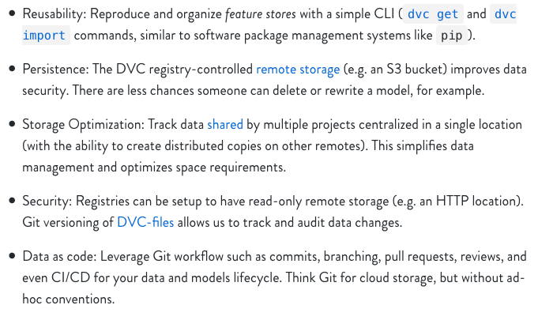

## How Build and Use a Data Registry 

### What is a data registry? 
A data registry is simply a DVC project dedicated to the storage and tracking of data and/or models. To keep it simple, I like to have one for data 
and one for models. The registry provides an interface to your remote storage system of choice, through which you can use and update 
large data files in a carefully tracked and versioned manner. There are several notable advantages of using such a system, best explained by the DVC makers themselves:



I will be using AWS S3 for the remote storage in this tutorial since that is what we use on my team, but the principles are the same
whether you are using local storage, GCP, SSH, etc. For a complete list of supported remote storage types, see [here](https://dvc.org/doc/command-reference/remote/add)

### Setup 
1. Set up remote storage 
    
      Suppose we have an s3 bucket called `datasets` which we use to store all our data and we have our aws access credentials stored in a profile called `dvc`.
2. Initialize your DVC project and remote
    
    In a fresh git repo, initialize DVC, add the s3 bucket as a remote and modify the profile to ensure access, then commit
    the changes. The `-d` flag indicates that this will be the DVC project's default remote. 
    
    ``` 
    dvc init
    dvc remote add -d datasets s3://datasets/dvc-data-registry
    dvc remote modify datasets profile dvc
    git add . && git commit -m "setup dvc remote" && git push
    ```


### Adding Data to the Registry 

I work with a combination of audio and text data. The workflow usually involves first
transcribing audio using an ASR model and then performing some kind of NLP on the resulting transcripts. 
I like to keep raw and processed data separate, and then organize the subdirectories according to type. So for example, my data registry might 
have the following structure: 

   ```
        sample-data-registry
        ├── raw
        │   ├── audio
        │   ├── text
        ├── text
        │   ├── transcripts
   ```

Now I want to add some raw audio data to my DVC data registry, a file called `recording.wav` that I have stored locally. 

1. Copy raw data to appropriate `raw` directory and track with DVC by calling `dvc add` 
    
   ``` 
    cp ~/Downloads/recording.wav raw/audio/
    dvc add raw/audio/recording.wav
    git add . && git commit -m "add raw recording data" && git push
    ```

2. Push data to remote storage 

    ``` 
    dvc push 
    git add . && git commit -m "push recording data to s3" && git push 
    ```

If you go look at the datasets bucket, you will find a bunch of random folders with a few files each - when you push data 
to your remote, DVC stores them in a content-addressable way. As such, you don't have to worry about duplication. The lack of 
human-readability here also means that you must rely on your neatly organized data registry for pulling/pushing data to the cloud, 
preventing any accidental deletions or changes and effectively forcing everyone on the team to use DVC :)  

### Using Data from the Registry 

Now that my raw audio file, `recordings.wav` is catalogued in my data registry and stored in s3, I want to transcribe it. 
I already have a DVC project in a repo for doing transcription with an ASR model. First I have to import the raw data into 
the transcription project repo. 

First let's get a list of what is available in the data registry (`-R` flag searches recursively to find all files in the repo): 
    ``` 
    dvc list -R https://github.com/ehutt/sample-data-registry
    ``` 
    
   output: 
   
   ```
    README.md
    raw/audio/.gitignore
    raw/audio/recording.wav
    raw/audio/recording.wav.dvc
   ```
We can see our recording there, now let's import it. We always use `dvc import` as opposed to `dvc get` since the former maintains any dependencies on the data source (i.e. the registry repo) while the latter is a simple download. 

Import data to your local workspace (must be an initialized DVC project) by specifying the registry repo and the 
path to the desired data.

   ``` 
    dvc import https://github.com/ehutt/sample-data-registry \
    raw/audio/recording.wav
   ```

### Create a Pipeline Stage

Now that I have my imported audio data, I can run my ASR model to get a transcription. I use a `dvc run` command to initiate
the transcription stage, which will keep track of which data, model, and parameters were used to generate the transcription. The `-d` flag
indicates a dependency (here, dependencies are the raw audio and the model code) and `-o` indicates an output (here, the transcript).
    
   ``` 
    dvc run -f transcribe.dvc \
    -d recording.wav \
    -d transcribe.py \
    -o transcript.txt \
    python transcribe.py recording.wav 
   ```
Running this stage generates a text file, which I now want to add to my data registry. To do so, simply copy the file 
to the registry repo and call `dvc add` again. Don't forget to `git commit` and `dvc push`. Now the data registry looks something like this: 

   ```
    data-registry
    ├── raw
    │   ├── audio
    │       ├──recording.wav
    ├── text
    │   ├── transcripts
    │       ├──recording.txt     
   ```

### Data Registry Tips and Tricks 

* To make sure you have the latest version of an imported dataset, run `dvc update` to pull any changes from remote storage.
* In the situation where you want to modify a raw dataset and store the result in your data registry, it is also possible 
to perform the steps from within the registry repo itself. In mine, I have a folder to store code so that when I do any data processing 
(e.g. take some raw text and remove html artifacts), I can maintain the dependencies using `dvc run`, without having to 
perform the above steps of copying outputs from another project into the registry and using `dvc add`, since this stops the 
DVC-tracked trail of dependencies. 
* I like to store all my DVC stage files in a dedicated folder called `dvc_files` to avoid cluttering the project repo. 
